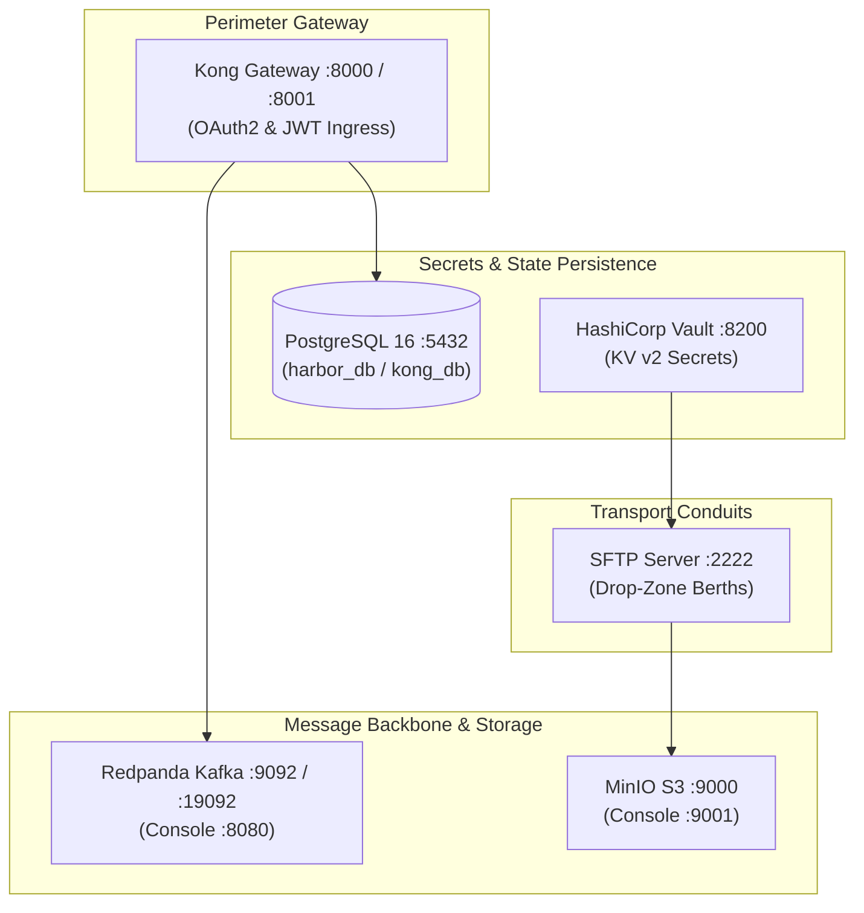
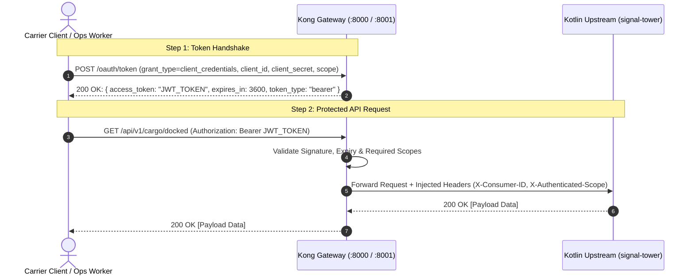

# Harbor Master Operational Runbook: Local Infrastructure & Security Playbook

> **Document Version:** `1.0.0`  
> **Author:** Intelligence Officer & Nav-Archivist Vesper 'Vector' Vance  
> **Classification:** Spaceport Operations & Perimeter Infrastructure Standard  
> **Target Environment:** Local Docker Compose / Minikube Sandbox / Stage Emulation

---

## 1. Quickstart & Cluster Orchestration

Harbor Master relies on a modular Docker Compose architecture utilizing Compose Native Includes (`include:` in `docker-compose.yaml`). This decouples infrastructure services into discrete units located in `deploy/local/services/` while sharing the internal bridge network `harbor-net`.



### 1.1 Cluster Lifecycle Commands

#### Booting the Cluster
To bring up the entire local infrastructure stack in detached mode:

```bash
# From the project root: /home/warlock/projects/harbor-master
docker compose up -d
```

Compose will automatically evaluate includes, wait for database readiness, execute Kong database schema migrations (`harbor-kong-migrations`), execute MinIO bucket initialization (`harbor-minio-init`), and spin up all operational consoles.

#### Checking Cluster Health & Status
Verify that all containers are healthy and running:

```bash
docker compose ps
```

Expected healthy output:
```text
NAME                     IMAGE                                  COMMAND                  SERVICE             CREATED         STATUS                   PORTS
harbor-kong              kong:3.7-ubuntu                        "/docker-entrypoint.…"   kong                1 minute ago    Up 1 minute (healthy)    0.0.0.0:8000->8000/tcp, 0.0.0.0:8001->8001/tcp
harbor-kong-migrations   kong:3.7-ubuntu                        "/docker-entrypoint.…"   kong-migrations     1 minute ago    Exited (0)               
harbor-minio             minio/minio:RELEASE.2024-05-28T07-15-04Z "minio server /data…" minio               1 minute ago    Up 1 minute (healthy)    0.0.0.0:9000->9000/tcp, 0.0.0.0:9001->9001/tcp
harbor-minio-init        minio/mc:latest                        "/bin/sh /scripts/01…"   minio-init          1 minute ago    Exited (0)               
harbor-postgres          postgres:16-alpine                     "docker-entrypoint.s…"   postgres            1 minute ago    Up 1 minute (healthy)    0.0.0.0:5432->5432/tcp
harbor-redpanda          docker.redpanda.com/redpandadata/redpanda:v24.1.8 "redpanda start --sm…" redpanda   1 minute ago    Up 1 minute (healthy)    0.0.0.0:9092->9092/tcp, 0.0.0.0:9644->9644/tcp, 0.0.0.0:19092->19092/tcp
harbor-redpanda-console  docker.redpanda.com/redpandadata/console:v2.6.0  "/app/console"         redpanda-console    1 minute ago    Up 1 minute              0.0.0.0:8080->8080/tcp
harbor-sftp              atmoz/sftp:latest                      "/entrypoint vendor_…"   sftp                1 minute ago    Up 1 minute              0.0.0.0:2222->22/tcp
harbor-vault             hashicorp/vault:1.16                   "docker-entrypoint.s…"   vault               1 minute ago    Up 1 minute (healthy)    0.0.0.0:8200->8200/tcp
```

#### Stopping the Cluster
To gracefully stop all containers while retaining persistent volume state:

```bash
docker compose stop
```

#### Full Teardown & Volume Reset
To destroy all containers and remove all local database, S3, Kafka, and SFTP volumes:

```bash
docker compose down -v
```

---

### 1.2 Console Credentials & Network Topology Matrix

| Service | Container Name | Host Port | Internal Port | Protocol / Auth | Credentials / Tokens | Web UI / Endpoints |
| :--- | :--- | :--- | :--- | :--- | :--- | :--- |
| **Kong Proxy Gateway** | `harbor-kong` | `8000` | `8000` | HTTP/HTTPS | OAuth2 Bearer Token | `http://localhost:8000` |
| **Kong Admin API** | `harbor-kong` | `8001` | `8001` | REST | None (Dev / Local) | `http://localhost:8001/status` |
| **PostgreSQL** | `harbor-postgres` | `5432` | `5432` | PostgreSQL wire | `harbor_admin` / `harbor_password` (`harbor_db`)<br/>`kong` / `kong_password` (`kong_db`) | `localhost:5432` |
| **HashiCorp Vault** | `harbor-vault` | `8200` | `8200` | HTTP REST / UI | Token: `harbor-vault-root-token` | `http://localhost:8200/ui` |
| **MinIO S3 API** | `harbor-minio` | `9000` | `9000` | S3 REST API | `harbor_admin` / `harbor_password` | `http://localhost:9000` |
| **MinIO Console** | `harbor-minio` | `9001` | `9001` | Web UI | `harbor_admin` / `harbor_password` | `http://localhost:9001` |
| **Redpanda Kafka** | `harbor-redpanda` | `19092` (ext)<br/>`9092` (int) | `9092` | Kafka Protocol | Anonymous / Dev | `localhost:19092` |
| **Redpanda Admin** | `harbor-redpanda` | `9644` | `9644` | REST | Anonymous / Dev | `http://localhost:9644/v1/status/ready` |
| **Redpanda Console** | `harbor-redpanda-console` | `8080` | `8080` | Web UI | None | `http://localhost:8080` |
| **SFTP Mock Berth** | `harbor-sftp` | `2222` | `22` | SFTP / SSH | `vendor_push` / `dock_password` (`/inbox`)<br/>`titan_shipping` / `dock_password` (`/exports`, `/archive`) | `sftp -P 2222 vendor_push@localhost` |

---

## 2. Kong OAuth2 & JWT Security Playbook

Harbor Master uses Kong Gateway as its single perimeter boundary guard. All external ingress traffic (REST manifests, upload streams, carrier status queries) must negotiate OAuth2 credentials at Kong before hitting downstream Kotlin services (`signal-tower`, `approach-watcher`, `quarantine-validator`).



---

### 2.1 Step 1: Register Upstream Service and Route

Register the downstream service (`signal-tower`) and its exposed API route with the Kong Admin API.

```bash
# 1. Register the upstream service
curl -i -X POST http://localhost:8001/services \
  --data "name=signal-tower" \
  --data "url=http://host.docker.internal:8084"

# 2. Register the cargo API route
curl -i -X POST http://localhost:8001/services/signal-tower/routes \
  --data "name=cargo-route" \
  --data "paths[]=/api/v1/cargo" \
  --data "strip_path=false"
```

---

### 2.2 Step 2: Enable the Kong OAuth2 Plugin

Configure OAuth2 with client credentials grant, 1-hour expiration, and mandatory scopes:

```bash
curl -i -X POST http://localhost:8001/services/signal-tower/plugins \
  --data "name=oauth2" \
  --data "config.enable_client_credentials=true" \
  --data "config.token_expiration=3600" \
  --data "config.scopes=cargo:read" \
  --data "config.scopes=cargo:write" \
  --data "config.scopes=ops:admin" \
  --data "config.mandatory_scope=true" \
  --data "config.accept_http_if_already_terminated=true"
```

---

### 2.3 Step 3: Register Consumers

Create consumer identities for trusted shipping carriers and internal operations workers.

```bash
# Consumer 1: Carrier Titan
curl -i -X POST http://localhost:8001/consumers \
  --data "username=carrier-titan" \
  --data "custom_id=carrier-titan-001"

# Consumer 2: Ops Worker
curl -i -X POST http://localhost:8001/consumers \
  --data "username=ops-worker" \
  --data "custom_id=ops-worker-999"
```

---

### 2.4 Step 4: Generate Client ID and Client Secret Pairs

Provision OAuth2 application credentials for each consumer.

```bash
# Provision credentials for carrier-titan
curl -i -X POST http://localhost:8001/consumers/carrier-titan/oauth2 \
  --data "name=TitanCarrierApp" \
  --data "client_id=carrier-titan-id" \
  --data "client_secret=carrier-titan-secret-key" \
  --data "redirect_uris=http://localhost:8080/callback"

# Provision credentials for ops-worker
curl -i -X POST http://localhost:8001/consumers/ops-worker/oauth2 \
  --data "name=HarborOpsConsole" \
  --data "client_id=ops-worker-id" \
  --data "client_secret=ops-worker-secret-key" \
  --data "redirect_uris=http://localhost:8080/callback"
```

---

### 2.5 Step 5: Scope, Role, and Audience Architecture

Harbor Master enforces role-based access control (RBAC) through granular OAuth2 scopes and audience assertions:

| Scope | Role / Assignment | Permitted Actions |
| :--- | :--- | :--- |
| `cargo:read` | Carrier & Ops | Query docked payload ledger, inspection status, and manifest verification records (`GET /api/v1/cargo/docked`, `GET /api/v1/cargo/{id}`) |
| `cargo:write` | Carrier | Submit cargo manifests, initiate direct-to-storage stream uploads, request intake locks (`POST /api/v1/cargo/intake`) |
| `ops:admin` | Harbor Master Operations | Quarantine manual override, berth credential rotation, discharge re-routing, DLQ redelivery |

**Standard Audience (`aud`):** `https://api.harbor.local`  
**Token Issuer (`iss`):** `https://api.harbor.local/oauth` (or Kong Gateway perimeter address)

---

### 2.6 Step 6: Executing the OAuth2 Token Handshake

Clients authenticate using the `client_credentials` grant flow against the Kong Gateway proxy port (`8000`).

#### Requesting a Token for Carrier Titan (`cargo:read cargo:write`)
```bash
curl -i -X POST http://localhost:8000/oauth/token \
  -H "Content-Type: application/x-www-form-urlencoded" \
  --data "grant_type=client_credentials" \
  --data "client_id=carrier-titan-id" \
  --data "client_secret=carrier-titan-secret-key" \
  --data "scope=cargo:read cargo:write"
```

#### Expected 200 OK JSON Response:
```json
{
  "token_type": "bearer",
  "access_token": "e0a7b4f2c98d41e2a0f823491bcdef0123456789abcdef0123456789abcdef01",
  "expires_in": 3600,
  "scope": "cargo:read cargo:write"
}
```

#### Requesting an Ops Token (`ops:admin`)
```bash
curl -i -X POST http://localhost:8000/oauth/token \
  -H "Content-Type: application/x-www-form-urlencoded" \
  --data "grant_type=client_credentials" \
  --data "client_id=ops-worker-id" \
  --data "client_secret=ops-worker-secret-key" \
  --data "scope=ops:admin cargo:read"
```

---

### 2.7 Step 7: Calling Protected API Endpoints

Pass the acquired token as a Bearer token in the `Authorization` HTTP header.

#### Querying Docked Cargo Ledger (`cargo:read` required)
```bash
TOKEN="e0a7b4f2c98d41e2a0f823491bcdef0123456789abcdef0123456789abcdef01"

curl -i -X GET http://localhost:8000/api/v1/cargo/docked \
  -H "Authorization: Bearer ${TOKEN}" \
  -H "Accept: application/json"
```

#### Injected Downstream Headers
When Kong validates the token, it forwards the request to the upstream service with security context headers:
- `X-Consumer-ID`: UUID of the authenticated consumer
- `X-Consumer-Username`: `carrier-titan` or `ops-worker`
- `X-Consumer-Custom-ID`: `carrier-titan-001`
- `X-Authenticated-Scope`: `cargo:read cargo:write`
- `X-Authenticated-Userid`: Internal credential ID
- `X-Anonymous-Consumer`: `false`

---

### 2.8 Step 8: Token Introspection & Revocation

Kong Admin API provides management and inspection endpoints for issued tokens.

#### List All Active Tokens
```bash
curl -s http://localhost:8001/oauth2_tokens | jq .
```

#### Inspect / Verify Specific Token Details
```bash
TOKEN_ID="<token_uuid_or_access_token>"

curl -s http://localhost:8001/oauth2_tokens/${TOKEN_ID} | jq .
```

#### Revoke a Compromised or Expired Token
```bash
curl -i -X DELETE http://localhost:8001/oauth2_tokens/${TOKEN_ID}
```

---

## 3. Downstream Kotlin JWT & Security Context Validation

Downstream Kotlin microservices (`signal-tower`, `approach-watcher`, `quarantine-validator`) validate security context using either the Kong injected upstream headers or decoded JWT claims.

### 3.1 Idiomatic Kotlin Security Interceptor & Validator

The following clean-room Kotlin component demonstrates parsing Kong security headers, validating required scopes, and enforcing the Harbor Master security perimeter:

```kotlin
package io.worksbyworrell.harbor.security

import jakarta.servlet.FilterChain
import jakarta.servlet.http.HttpServletRequest
import jakarta.servlet.http.HttpServletResponse
import org.springframework.http.HttpStatus
import org.springframework.security.core.context.SecurityContextHolder
import org.springframework.web.filter.OncePerRequestFilter
import java.time.Instant

/**
 * Immutable security context populated from Kong perimeter authentication headers.
 */
data class HarborSecurityContext(
    val consumerId: String,
    val consumerUsername: String,
    val customId: String?,
    val scopes: Set<String>,
    val authenticatedAt: Instant = Instant.now()
) {
    fun hasScope(requiredScope: String): Boolean = scopes.contains(requiredScope)
    fun hasAnyScope(vararg requiredScopes: String): Boolean = requiredScopes.any { scopes.contains(it) }
    fun hasAllScopes(vararg requiredScopes: String): Boolean = requiredScopes.all { scopes.contains(it) }

    fun requireScope(requiredScope: String) {
        if (!hasScope(requiredScope)) {
            throw InsufficientScopeException(
                "Access denied: Missing required scope '$requiredScope'. Granted scopes: $scopes"
            )
        }
    }
}

class InsufficientScopeException(message: String) : RuntimeException(message)

/**
 * Servlet filter intercepting Kong Gateway injected perimeter headers.
 */
class KongSecurityContextFilter : OncePerRequestFilter() {

    companion object {
        const val HEADER_CONSUMER_ID = "X-Consumer-ID"
        const val HEADER_CONSUMER_USERNAME = "X-Consumer-Username"
        const val HEADER_CONSUMER_CUSTOM_ID = "X-Consumer-Custom-ID"
        const val HEADER_AUTHENTICATED_SCOPE = "X-Authenticated-Scope"
    }

    override fun doFilterInternal(
        request: HttpServletRequest,
        response: HttpServletResponse,
        filterChain: FilterChain
    ) {
        val consumerId = request.getHeader(HEADER_CONSUMER_ID)
        val username = request.getHeader(HEADER_CONSUMER_USERNAME)
        val rawScopes = request.getHeader(HEADER_AUTHENTICATED_SCOPE)

        if (consumerId.isNullOrBlank() || username.isNullOrBlank()) {
            // Request bypassed Kong perimeter or lacks credentials
            response.sendError(
                HttpStatus.UNAUTHORIZED.value(),
                "Perimeter authentication missing: Request must route through Kong Gateway"
            )
            return
        }

        val scopes = rawScopes?.split(" ", ",")?.filter { it.isNotBlank() }?.toSet() ?: emptySet()
        val customId = request.getHeader(HEADER_CONSUMER_CUSTOM_ID)

        val securityContext = HarborSecurityContext(
            consumerId = consumerId,
            consumerUsername = username,
            customId = customId,
            scopes = scopes
        )

        request.setAttribute("HARBOR_SECURITY_CONTEXT", securityContext)
        filterChain.doFilter(request, response)
    }
}
```

### 3.2 Direct Nimbus JOSE / JWT Verification (Zero-Trust Backup)

When validating JWT signatures and claims directly against Nimbus JOSE without relying solely on headers:

```kotlin
package io.worksbyworrell.harbor.security

import com.nimbusds.jose.JWSVerifier
import com.nimbusds.jose.crypto.RSASSAVerifier
import com.nimbusds.jwt.SignedJWT
import java.security.interfaces.RSAPublicKey
import java.util.Date

class HarborJwtValidator(private val publicKey: RSAPublicKey) {

    private val expectedIssuer = "https://api.harbor.local/oauth"
    private val expectedAudience = "https://api.harbor.local"

    fun validateToken(tokenString: String): Result<HarborSecurityContext> = runCatching {
        val signedJwt = SignedJWT.parse(tokenString)
        val verifier: JWSVerifier = RSASSAVerifier(publicKey)

        if (!signedJwt.verify(verifier)) {
            throw SecurityException("Invalid JWT signature")
        }

        val claims = signedJwt.jwtClaimsSet
        val now = Date()

        if (claims.expirationTime == null || claims.expirationTime.before(now)) {
            throw SecurityException("JWT token has expired")
        }

        if (claims.issuer != expectedIssuer) {
            throw SecurityException("Untrusted issuer: ${claims.issuer}")
        }

        if (!claims.audience.contains(expectedAudience)) {
            throw SecurityException("Audience mismatch: expected '$expectedAudience', got ${claims.audience}")
        }

        val rawScope = claims.getStringClaim("scope") ?: ""
        val scopes = rawScope.split(" ").filter { it.isNotBlank() }.toSet()

        HarborSecurityContext(
            consumerId = claims.subject ?: "unknown",
            consumerUsername = claims.getStringClaim("username") ?: claims.subject,
            customId = claims.getStringClaim("custom_id"),
            scopes = scopes
        )
    }
}
```

---

## 4. HashiCorp Vault Secrets Playbook

Harbor Master externalizes all dynamic transport credentials, SFTP private keys, and S3 IAM secrets to HashiCorp Vault. In local dev mode, Vault is pre-seeded via `deploy/local/bootstrap/vault/01-init-secrets.sh`.

### 4.1 Vault Access Coordinates

- **Web UI URL:** `http://localhost:8200/ui`
- **Root Dev Token:** `harbor-vault-root-token`
- **REST API Base:** `http://localhost:8200/v1`
- **Mount Point:** `secret/` (KV v2 engine)

---

### 4.2 Reading Secrets via REST API

#### Check Vault Health
```bash
curl -s http://localhost:8200/v1/sys/health | jq .
```

#### Read Inbound SFTP Berth Credentials
```bash
curl -s -H "X-Vault-Token: harbor-vault-root-token" \
  http://localhost:8200/v1/secret/data/berths/inbound-sftp | jq .data.data
```

Expected output:
```json
{
  "password": "dock_password",
  "username": "vendor_push"
}
```

#### Read Remote Titan SFTP SSH Key
```bash
curl -s -H "X-Vault-Token: harbor-vault-root-token" \
  http://localhost:8200/v1/secret/data/berths/titan-remote-sftp | jq .data.data
```

#### Read MinIO S3 Root Credentials
```bash
curl -s -H "X-Vault-Token: harbor-vault-root-token" \
  http://localhost:8200/v1/secret/data/storage/minio | jq .data.data
```

---

### 4.3 Creating and Updating Berth Secrets

To dynamically add or rotate credentials for a new shipping partner berth:

```bash
# Registering a new carrier berth secret
curl -i -X POST \
  -H "X-Vault-Token: harbor-vault-root-token" \
  -H "Content-Type: application/json" \
  -d '{
    "data": {
      "username": "orion_freight",
      "password": "secure_orbital_pass_2026",
      "endpoint": "sftp://sftp.orion.local:2222",
      "drop_path": "/intake/cargo"
    }
  }' \
  http://localhost:8200/v1/secret/data/berths/orion-freight
```

Verify the write:
```bash
curl -s -H "X-Vault-Token: harbor-vault-root-token" \
  http://localhost:8200/v1/secret/data/berths/orion-freight | jq .data.data
```

---

## 5. MinIO S3 & Redpanda Topic Inspection

### 5.1 MinIO S3 Object Storage Inspection

Harbor Master maintains strict quarantine lifecycle storage:
- `harbor-quarantine`: Ephemeral landing bucket where unvetted payload archives land during direct-to-storage streaming.
- `harbor-admitted`: Permanent promotion bucket where validated cargo is promoted via zero-copy server-side metadata move.

#### Accessing the MinIO Web Console
1. Navigate to `http://localhost:9001` in your browser.
2. Sign in with:
   - **Username:** `harbor_admin`
   - **Password:** `harbor_password`
3. Verify both `harbor-quarantine` and `harbor-admitted` buckets exist.

#### Inspecting Buckets via MinIO Client (`mc` CLI inside container)
```bash
# List all buckets
docker exec -it harbor-minio-init mc ls local/

# List contents of the quarantine bucket
docker exec -it harbor-minio-init mc ls local/harbor-quarantine/

# Inspect object metadata and tags
docker exec -it harbor-minio-init mc stat local/harbor-quarantine/<object_name>
```

---

### 5.2 Redpanda Kafka Event Backbone Inspection

Harbor Master uses Redpanda for sub-millisecond, zero-dependency Kafka-compatible event streaming across modules.

#### Accessing the Redpanda Console UI
1. Navigate to `http://localhost:8080` in your browser.
2. Inspect cluster brokers (`redpanda:9092`), topic partitions, and consumer lag.

#### Core Harbor Event Topics

| Topic Name | Producer Module | Consumer Module | Payload Schema / Purpose |
| :--- | :--- | :--- | :--- |
| `ifm.file.discovered` | `approach-watcher` | `approach-watcher` | File sighted on remote Berth (SFTP poller, HTTP webhook) |
| `ifm.file.fetched` | `approach-watcher` | `stevedore-extractor` | Direct-to-storage stream finished, docked payload recorded in Postgres |
| `ifm.file.extracted` | `stevedore-extractor` | `quarantine-validator` | Archive decompressed, leaf files flattened, ready for schema sieve |
| `ifm.file.status` | `quarantine-validator` / `signal-tower` | Harbor UI / Discord Webhooks | Status transition (`DOCKED`, `INSPECTING`, `ADMITTED`, `QUARANTINED`) |

#### Inspecting Topics via Redpanda CLI (`rpk`)
```bash
# List all active Kafka topics
docker exec -it harbor-redpanda rpk topic list

# Create the standard Harbor Master topic suite if missing
docker exec -it harbor-redpanda rpk topic create \
  ifm.file.discovered \
  ifm.file.fetched \
  ifm.file.extracted \
  ifm.file.status

# Stream events in real-time from the status topic
docker exec -it harbor-redpanda rpk topic consume ifm.file.status -f "%t | %k | %v\n"
```

---

## 6. Troubleshooting & Operational Errata

### 6.1 Database Migration & Connection Failures

**Symptom:** `harbor-kong` fails to start or continuously restarts with `[error] could not bootstrap database`.  
**Root Cause:** Kong requires its own database (`kong_db`) and role (`kong`) initialized by PostgreSQL before running `kong migrations bootstrap`.  
**Remediation:**
1. Check Postgres logs to verify `01-init-dbs.sql` executed:
   ```bash
   docker compose logs postgres | grep -i kong
   ```
2. Verify database connectivity manually:
   ```bash
   docker exec -it harbor-postgres psql -U kong -d kong_db -c '\l'
   ```
3. Run migrations manually if container completed prematurely:
   ```bash
   docker compose run --rm kong-migrations
   ```

---

### 6.2 Complete Environment Reset Procedure

When experiencing corrupted Kafka partition state, dirty database tables, or desynchronized OAuth tokens, perform a full clean reset:

```bash
# 1. Stop and remove all containers, networks, and persistent volumes
docker compose down -v

# 2. Rebuild and launch the infrastructure stack
docker compose up -d

# 3. Wait 10 seconds for init jobs to complete, then verify status
sleep 10
docker compose ps
```

---

### 6.3 Diagnostic Log Inspection Commands

```bash
# Stream logs for Kong Gateway
docker compose logs -f kong

# Stream logs for PostgreSQL
docker compose logs -f postgres

# Stream logs for HashiCorp Vault
docker compose logs -f vault

# Stream logs for Redpanda Kafka broker
docker compose logs -f redpanda

# Stream logs for SFTP server
docker compose logs -f sftp
```

---

### 6.4 Common HTTP & Gateway Error Diagnostic Matrix

| HTTP Status | Error Reason | Root Cause | Resolution |
| :--- | :--- | :--- | :--- |
| `401 Unauthorized` | `{"message":"Unauthorized"}` | Missing or expired OAuth Bearer token in `Authorization` header | Execute token handshake (`POST /oauth/token`) and update `Authorization: Bearer <token>`. |
| `401 Unauthorized` | `{"message":"Invalid client credentials"}` | Wrong `client_id` or `client_secret` during token handshake | Check consumer credentials with `curl http://localhost:8001/consumers/<id>/oauth2`. |
| `403 Forbidden` | `{"message":"Forbidden: insufficient scope"}` | Token does not contain the required scope (e.g. attempting write with `cargo:read`) | Re-request token including required scope (`scope=cargo:write`). |
| `404 Not Found` | `{"message":"no Route matched with those values"}` | Request path does not match any registered Kong route prefix | Verify route configuration on `http://localhost:8001/routes`. Path must start with `/api/v1/cargo`. |
| `502 Bad Gateway` | `{"message":"An invalid response was received from the upstream server"}` | Upstream microservice (`signal-tower`) is not running on target port | Ensure `signal-tower` is running on `host.docker.internal:8084` or docker host network. |
| `504 Gateway Timeout` | `{"message":"The upstream server failed to respond in time"}` | Upstream service blocked on heavy synchronous processing or deadlock | Check Kotlin virtual thread logs and memory cgroups. Harbor Master requires zero-heap direct streaming. |
