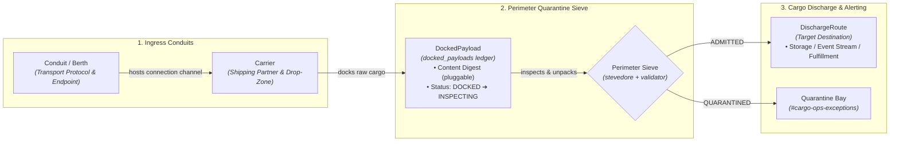
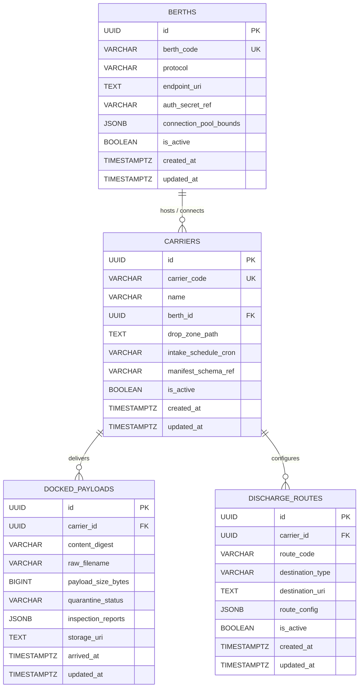

# Harbor Master — Architecture Specification & System Manifest

**Document Version:** 1.1.0  
**Classification:** Public Domain / Spaceport Maritime Cargo Ingress  
**Status:** Approved Architecture Baseline — Full Maritime Domain Model  

---

## 1. Executive Architecture Overview

`harbor-master` is a high-throughput, multi-protocol cargo intake, quarantine, and manifest-validation engine. Designed for mission-critical port authority and orbital cargo docks, it establishes a deterministic gatekeeper perimeter between unverified external transport conduits and trusted internal downstream storage/processing clusters.

Every payload entering the perimeter is treated as untrusted, isolated immediately upon ingress into an ephemeral quarantine prefix, fingerprinted with pluggable algorithm-prefixed content digests, inspected via zero-trust validation sieves, and routed deterministically.

```
       [ External Transports: SFTP / HTTP Stream / S3 / REST Manifest ]
                                    │
                                    ▼
                        ┌──────────────────────┐
                        │   approach-watcher   │◄─── Berths & Carriers Ingress
                        └──────────┬───────────┘
                                   │ Records Intake (Status: DOCKED)
                                   ▼
                     ┌────────────────────────────┐
                     │PostgreSQL: docked_payloads │ (Immutable Perimeter Ledger)
                     └─────────────┬──────────────┘
                                   │
                   ┌───────────────┴───────────────┐
                   ▼                               ▼
        ┌─────────────────────┐        ┌───────────────────────┐
        │ stevedore-extractor │        │  quarantine-validator │
        │ (Stream Decompress) │───────►│(Carrier & Schema Sieve│
        └─────────────────────┘        └───────────┬───────────┘
                                                   │
                                    ┌──────────────┴──────────────┐
                                    ▼                             ▼
                        ┌───────────────────────┐     ┌───────────────────────┐
                        │     signal-tower      │     │    Quarantine Bay     │
                        │ (DischargeRoute / Ops)│     │(#cargo-ops-exceptions)│
                        └───────────────────────┘     └───────────────────────┘
```

### 1.1 The Four Pillars of Port Logistics

The system domain model is strictly anchored in four core maritime logistics pillars:

1. **`Berths`** (Transport/Connection Channel): The physical or virtual ingress conduits. Governs transport protocols (`SFTP`, `HTTP_STREAM`, `S3_BUCKET`, `REST`, `MANUAL_DROP`), network endpoints, authentication secrets (SFTP credentials, S3 IAM/keys, HTTP bearer tokens), and connection pooling bounds.
2. **`Carriers`** (Intake Sources/Shipping Partners): The external consignor/carrier identity and contracts. Defines the shipping partner identity, drop-zone root path within the assigned Berth, intake schedule/cadence (cron), and expected manifest schema contract.
3. **`DockedPayloads`** (Immutable Perimeter Ledger): The core perimeter ledger table (`docked_payloads`). Captures algorithm-prefixed content digests (`content_digest`), payload byte size, raw filename, arrival timestamp, quarantine status lifecycle (`DOCKED`, `INSPECTING`, `QUARANTINED`, `ADMITTED`), and JSONB inspection reports. Records every payload ever docked at the perimeter.
4. **`DischargeRoutes`** (Routing Destinations): Post-quarantine dispatch routing governing where verified, extracted cargo goes once admitted (target storage buckets, event streams, downstream fulfillment services, webhook endpoints).

### 1.2 Ingress to Discharge Lifecycle Flow



### 1.3 Core Technology Stack
- **Language & Runtime:** Kotlin 2.x on Java 21 LTS (JVM 21 virtual threads / Project Loom for high-concurrency I/O).
- **Core Persistence:** PostgreSQL 16+ (ACID perimeter ledger, JSONB validation reports, hash index lookups).
- **Architecture Standard:** Uncle Bob Clean Architecture (strict inward dependency rule, immutable domain models, decoupled protocol adapters).
- **Deployment & Orchestration:** Minikube (Local Dev & Test) / Production Kubernetes. Containerized ephemeral workers with bounded memory cgroups.

### 1.4 Direct-to-Storage Streaming Architecture & Quarantine Storage Lifecycle

Harbor Master employs a zero-heap, direct-to-storage streaming design engineered for deterministic resource consumption regardless of cargo scale:

- **Zero JVM Heap Buffering**: Harbor Master **NEVER** buffers raw payload octets into JVM heap memory. Byte streams are piped directly from ingress conduits (SFTP, chunked HTTP) to object storage or ephemeral scratch volumes using small, bounded stream buffers (e.g. 64KB chunks).
- **Lean Memory Cgroups & Payload-Size Invariance**: Containers execute within strict, lean memory cgroups (bounded JVM heap `-Xmx512m`, container limit `768Mi`, request `256Mi`). Because all I/O is streamed in small 64KB chunks, payload file size is completely irrelevant to memory footprint: processing a 50MB payload vs. a 50GB payload both run comfortably inside the exact same 512MB RAM envelope without GC pressure or risk of Out-Of-Memory (OOM) termination.
- **Zero-CPU Native Digest Capture**: Rather than burning CPU cycles computing SHA-256 hashes across gigabytes of streaming data in application memory, storage-native digests (e.g., Google Cloud Storage CRC32C, AWS S3 ETag/MD5) are captured directly from storage adapter response metadata upon stream completion at zero extra CPU cost. Pluggable algorithms are supported and stored in `content_digest` with algorithm prefixes (e.g. `crc32c:a1b2c3d4`, `md5:...`, `sha256:...`).
- **Quarantine Storage Lifecycle**:
  - **Ephemeral Ingress Isolation**: All raw unvetted cargo lands directly in an ephemeral intake/quarantine storage prefix (e.g., `s3://harbor-dock/quarantine/{payload_id}/...`). Downstream business consumers have zero access to this prefix.
  - **Instantaneous Server-Side Promotion**: Once the payload traverses the inspection and validation sieves successfully, promotion from quarantine to admitted cargo is executed via an instantaneous server-side pointer flip / copy-free move in object storage (e.g., S3 copy/move or GCS rewrite), completely eliminating redundant network byte transfers.

---

## 2. Service Boundary Breakdown

```
harbor-master/
├── modules/
│   ├── common-domain/          # Core entities (Berth, Carrier, DockedPayload, DischargeRoute), value objects, failure taxonomy
│   ├── approach-watcher/       # Multi-protocol intake adapters (SFTP, HTTP Streaming, REST)
│   ├── stevedore-extractor/    # Streaming decompression, archive flattening, ZIP64 unpacker
│   ├── quarantine-validator/   # Schema sieve (XSD/JSON), carrier isolation, security gate
│   └── signal-tower/           # Fleet telemetry, discharge dispatcher, alerting webhooks
├── deploy/
│   ├── k8s/                    # Kubernetes manifests (Deployments, Services, ConfigMaps)
│   └── minikube/               # Local developer sandbox overlays & mock dependencies
└── docs/
    └── SPEC.md                 # System specification and architecture manual
```

### 2.1 `common-domain`
The foundational, dependency-free core containing immutable domain models, value objects, and deterministic business rules:
- **`Berth`**: Root aggregate representing the transport conduit, protocol endpoints, credentials reference, and connection limits.
- **`Carrier`**: Aggregate representing an external shipping partner, drop-zone root path, intake schedule cadence, and manifest schema contracts.
- **`DockedPayload`**: Root aggregate representing an unverified raw payload arriving at the dock, stamped with a deterministic UUID, algorithm-prefixed content digest (`content_digest`), byte size, raw filename, arrival timestamp, quarantine status (`DOCKED`, `INSPECTING`, `QUARANTINED`, `ADMITTED`), and inspection reports.
- **`DischargeRoute`**: Value object and entity governing post-admission cargo routing destinations (storage buckets, event streams, fulfillment services).
- **`CargoManifest` & `ManifestItem`**: Strongly-typed domain representations of bill-of-lading cargo contents, container manifests, and declared itemized cargo specs.
- **`ValidationResult`**: Monadic outcome (`Admitted` vs `Quarantined`) encapsulating zero-or-more validation rule violations, schema errors, or policy breaches.
- **`FailureClassification`**: First-class taxonomy splitting operational disruptions into deterministic categories (see Section 4).

### 2.2 `approach-watcher`
The perimeter sentinel. Operates non-blocking intake listeners and active pollers across heterogeneous transport protocols bound to registered `Berths` and `Carriers`:
- **Direct-to-Storage Streaming Ingress**: Harbor Master **NEVER** buffers payloads into the JVM heap. Byte streams are piped directly from ingress conduits (SFTP, chunked HTTP) to object storage or scratch volumes using small, bounded stream buffers (e.g. 64KB chunks). Ephemeral containers run with lean memory cgroups (bounded heap `-Xmx512m` / container limit `768Mi`), rendering payload file size completely irrelevant (50MB vs 50GB both run in 512MB RAM).
- **SFTP Inbound Poller**: Secure polling worker inspecting carrier remote drop directories, acquiring lock tokens, streaming remote octets directly into the ephemeral intake/quarantine storage prefix, and performing atomic handoffs.
- **HTTP Chunked Stream Receiver**: Reactive HTTP endpoints accepting streaming binary uploads piped directly to quarantine storage without intermediate JVM heap buffering.
- **Storage-Native Zero-CPU Digest Extraction**: Captures storage-native digests (e.g. GCS CRC32C, S3 ETag/MD5) directly from the storage adapter response metadata upon stream completion at zero extra CPU cost.
- **REST Manifest Intake**: Synchronous JSON/XML manifest submission endpoints for immediate pre-clearance validation.
- **Perimeter Registrar**: Writes raw incoming drop metadata into the immutable `docked_payloads` ledger prior to handoff, recording `content_digest`, byte size, and quarantine storage URI with initial quarantine status `DOCKED`.

### 2.3 `stevedore-extractor`
The cargo unloader and unpacker. Specializes in archive inspection and decompression under strict resource ceilings:
- **Payload Inspection Hand-off**: Transitions `docked_payloads` status to `INSPECTING`.
- **Direct-to-Storage Streaming Decompression**: Harbor Master **NEVER** buffers payloads or uncompressed archives into the JVM heap. Byte streams are decompressed directly to object storage or scratch volumes using small, bounded stream buffers (e.g. 64KB chunks) under lean memory cgroups (bounded heap `-Xmx512m` / container limit `768Mi`), ensuring a 50MB and a 50GB archive both decompress within the same 512MB RAM ceiling.
- **Quarantine Storage Lifecycle & Server-Side Promotion**: Payloads land and unpack in an ephemeral intake/quarantine storage prefix. Upon passing quarantine validation, promotion to admitted cargo is an instantaneous server-side pointer flip/move in object storage, eliminating unnecessary byte transfers.
- **ZIP64 Multi-Part Unpacking**: Robust handling of large compressed archives, nested structures, and multi-part archive volumes.
- **Leaf-File Flattening**: Traverses hierarchical directory structures within archives, flattening payload elements into deterministic canonical paths while neutralizing directory traversal attacks (`../` zip slips).
- **Decompression Bomb Defense**: Enforces strict expansion ratio caps (e.g., maximum 100:1 uncompressed-to-compressed size ratio) and aborts malicious bombs instantly.

### 2.4 `quarantine-validator`
The zero-trust security sieve and manifest gatekeeper:
- **Schema Validation Sieve**: Validates payload structures against strict XSD (XML) and JSON Schemas versioned per carrier contract.
- **Carrier Verification**: Asserts cryptographic or header provenance against carrier registry configurations.
- **Quarantine Isolation Gate**: Transitions `docked_payloads` to `ADMITTED` upon clean inspection, or locks them into `QUARANTINED` status if constraints are breached. Quarantined payloads are isolated from downstream fulfillment pipelines while retaining full raw bytes and diagnostic `inspection_reports` JSONB for forensic analysis.

### 2.5 `signal-tower`
The operational dispatcher, alerting beacon, and telemetry hub:
- **Discharge Dispatcher**: Routes verified (`ADMITTED`) cargo manifests and extracted items along carrier-configured `DischargeRoutes` to internal fleet operations, object stores, or event streams.
- **Telemetry & Metrics**: Emits OpenTelemetry metrics, Prometheus scrapable gauges (intake throughput, ingress latency, quarantine rate), and structured audit logs.
- **Operational Notifier**: Routes alerts according to failure taxonomy: operational system outages to infrastructure alerts, cargo data anomalies to `#cargo-ops-exceptions` webhooks.

---

## 3. Port Logistics Domain Model & Perimeter Relational Schema

The PostgreSQL perimeter schema maintains strict referential integrity across the 4 core maritime pillars, anchoring every byte entering the system to its source Berth, Carrier identity, and downstream Discharge Routes.

### 3.1 Architectural Rationale
1. **Zero-Trust Ingress Ledger (`docked_payloads`)**: Every byte stream touching the harbor perimeter is recorded before downstream processing. If downstream workers fail, crash, or restart, the perimeter record remains intact.
2. **Deduplication & Replay Defense**: By asserting content digest idempotency at the perimeter (`content_digest`), duplicate or re-delivered cargo drops are deduplicated or referenced immediately without triggering redundant extraction cycles.
3. **Forensic Audit Provenance**: Stores raw filename, carrier identity, arrival timestamp, quarantine lifecycle status, file size, and structured inspection diagnostic reports (`inspection_reports` JSONB). This guarantees non-repudiation and post-incident investigation for damaged or malicious cargo.
4. **Decoupled Pipeline Hand-off**: Downstream workers poll or receive event notifications keyed by immutable `docked_payloads.id`, decoupling ingest velocity from extraction, validation, and discharge velocity.
5. **Dynamic Routing Decoupling**: Separates the intake channel (`berths`), carrier contract (`carriers`), immutable perimeter history (`docked_payloads`), and outbound fulfillment destinations (`discharge_routes`).

### 3.2 Entity Relationship Model



### 3.3 PostgreSQL Perimeter DDL

```sql
-- ============================================================================
-- 1. BERTHS (Transport / Connection Channel)
-- ============================================================================
CREATE TABLE berths (
    id                      UUID PRIMARY KEY DEFAULT gen_random_uuid(),
    berth_code              VARCHAR(64) UNIQUE NOT NULL,
    protocol                VARCHAR(32) NOT NULL,
    endpoint_uri            TEXT NOT NULL,
    auth_secret_ref         VARCHAR(255),
    connection_pool_bounds  JSONB,
    is_active               BOOLEAN NOT NULL DEFAULT TRUE,
    created_at              TIMESTAMPTZ NOT NULL DEFAULT NOW(),
    updated_at              TIMESTAMPTZ NOT NULL DEFAULT NOW(),

    CONSTRAINT chk_berth_protocol CHECK (
        protocol IN ('SFTP', 'HTTP_STREAM', 'S3_BUCKET', 'REST', 'MANUAL_DROP')
    )
);

CREATE INDEX idx_berths_protocol_active 
    ON berths (protocol, is_active);

-- ============================================================================
-- 2. CARRIERS (Intake Sources / Shipping Partners)
-- ============================================================================
CREATE TABLE carriers (
    id                      UUID PRIMARY KEY DEFAULT gen_random_uuid(),
    carrier_code            VARCHAR(64) UNIQUE NOT NULL,
    name                    VARCHAR(255) NOT NULL,
    berth_id                UUID NOT NULL REFERENCES berths(id) ON DELETE RESTRICT,
    drop_zone_path          TEXT NOT NULL,
    intake_schedule_cron    VARCHAR(64),
    manifest_schema_ref     VARCHAR(255) NOT NULL,
    is_active               BOOLEAN NOT NULL DEFAULT TRUE,
    created_at              TIMESTAMPTZ NOT NULL DEFAULT NOW(),
    updated_at              TIMESTAMPTZ NOT NULL DEFAULT NOW()
);

CREATE INDEX idx_carriers_berth_id 
    ON carriers (berth_id);

CREATE INDEX idx_carriers_code_active 
    ON carriers (carrier_code, is_active);

-- ============================================================================
-- 3. DOCKED PAYLOADS (Immutable Perimeter Ledger)
-- ============================================================================
-- NOTE ON CONTENT DIGEST:
-- The 'content_digest' column stores algorithm-prefixed fingerprints 
-- (e.g., 'crc32c:a1b2c3d4', 'md5:d41d8cd98f00b204e9800998ecf8427e',
-- 'sha256:e3b0c44298fc1c149afbf4c8996fb92427ae41e4649b934ca495991b7852b855').
-- This replaces rigid single-hash schemes, enabling zero-CPU capture of storage-native
-- checksums (GCS CRC32C, S3 ETag/MD5) as well as conventional cryptographic digests.
CREATE TABLE docked_payloads (
    id                      UUID PRIMARY KEY DEFAULT gen_random_uuid(),
    carrier_id              UUID NOT NULL REFERENCES carriers(id) ON DELETE RESTRICT,
    content_digest          VARCHAR(128) NOT NULL,
    raw_filename            VARCHAR(255) NOT NULL,
    payload_size_bytes      BIGINT NOT NULL CHECK (payload_size_bytes >= 0),
    quarantine_status       VARCHAR(32) NOT NULL DEFAULT 'DOCKED',
    inspection_reports      JSONB,
    storage_uri             TEXT,
    arrived_at              TIMESTAMPTZ NOT NULL DEFAULT NOW(),
    updated_at              TIMESTAMPTZ NOT NULL DEFAULT NOW(),

    CONSTRAINT chk_quarantine_status CHECK (
        quarantine_status IN ('DOCKED', 'INSPECTING', 'QUARANTINED', 'ADMITTED')
    )
);

-- Indexing for deduplication and rapid content digest lookups
CREATE INDEX idx_docked_payloads_digest 
    ON docked_payloads (content_digest);

-- Indexing for worker polling and quarantine triaging
CREATE INDEX idx_docked_payloads_carrier_status 
    ON docked_payloads (carrier_id, quarantine_status);

CREATE INDEX idx_docked_payloads_status 
    ON docked_payloads (quarantine_status);

-- Indexing for time-series auditing and cleanup sweeps
CREATE INDEX idx_docked_payloads_arrived_at 
    ON docked_payloads (arrived_at DESC);

-- ============================================================================
-- 4. DISCHARGE ROUTES (Routing Destinations)
-- ============================================================================
CREATE TABLE discharge_routes (
    id                      UUID PRIMARY KEY DEFAULT gen_random_uuid(),
    carrier_id              UUID NOT NULL REFERENCES carriers(id) ON DELETE CASCADE,
    route_code              VARCHAR(64) NOT NULL,
    destination_type        VARCHAR(32) NOT NULL,
    destination_uri         TEXT NOT NULL,
    route_config            JSONB,
    is_active               BOOLEAN NOT NULL DEFAULT TRUE,
    created_at              TIMESTAMPTZ NOT NULL DEFAULT NOW(),
    updated_at              TIMESTAMPTZ NOT NULL DEFAULT NOW(),

    CONSTRAINT uq_carrier_route UNIQUE (carrier_id, route_code),
    CONSTRAINT chk_discharge_destination_type CHECK (
        destination_type IN ('STORAGE_BUCKET', 'EVENT_STREAM', 'FULFILLMENT_SERVICE', 'REST_WEBHOOK')
    )
);

CREATE INDEX idx_discharge_routes_carrier 
    ON discharge_routes (carrier_id, is_active);
```

---

## 4. Binary Failure Taxonomy

To maintain high availability and prevent alert fatigue, system anomalies are strictly bifurcated into two mutually exclusive operational domains:

```
                            [ Ingress Exception ]
                                       │
                    Is the fault in code/infrastructure?
                                 ╱          ╲
                             YES              NO
                             ╱                  ╲
                            ▼                    ▼
                ┌──────────────────────┐    ┌──────────────────────┐
                │     System Fault     │    │    Data Exception    │
                │  (Infrastructure/IO) │    │  (Payload/Contract)  │
                └──────────┬───────────┘    └──────────┬───────────┘
                           │                           │
                           ▼                           ▼
                  PagerDuty / SRE Paging       Discord Webhook Alert:
                  Escalation Tier 1            #cargo-ops-exceptions
```

### 4.1 System Faults (Infrastructure Failure)
- **Definition**: Failures caused by system environment, infrastructure degradation, software bugs, or resource starvation where the inbound cargo might be completely valid.
- **Triggers**:
  - Local disk full / ephemeral storage volume exhaustion.
  - PostgreSQL database connection pool starvation or host unreachable.
  - Network I/O timeout during SFTP transport handshake at a Berth.
  - Worker pod OOM (Out Of Memory) or container crash.
- **Resolution Path**: PagerDuty / SRE on-call rotation. The system enters exponential backoff and leaves the unverified payload in its current state (`DOCKED` or `INSPECTING`) for automated retry.

### 4.2 Data Exceptions (Cargo Contract Failure)
- **Definition**: The infrastructure is healthy, but the submitted cargo breaches security, validation, schema, or structural constraints.
- **Triggers**:
  - Malformed XML/JSON failing canonical XSD or JSON Schema validation per carrier contract.
  - Corrupted archive (CRC failure, truncated ZIP, nested zip-slip traversal attempt).
  - Unrecognized or unauthorized `carrier_code` / `carrier_id`.
  - Empty payload or expansion bomb ratio exceeded.
- **Resolution Path**: The payload is stamped with `quarantine_status = 'QUARANTINED'`, validation errors are stored as structured JSONB in `inspection_reports`, and a notification is dispatched to operations:
  - **Destination**: Discord Webhook `#cargo-ops-exceptions`.
  - **Payload**: Carrier ID, Carrier Code, Raw Filename, File Size, Content Digest (`content_digest`), Error Diagnostic Summary.
  - **Action**: No engineering pager is alerted; business/cargo operations staff contact the shipping carrier/vendor for re-transmission.

---

## 5. Minikube & Container Topology

### 5.1 Ephemeral Batch Worker Pattern
To prevent unbounded memory growth and cross-carrier resource contamination, archive extraction and schema validation execute inside constrained worker boundaries:
- **Streaming Handlers**: Streaming chunked decoders with max heap configured to `-Xmx512m` per worker pod.
- **Single-Payload Isolation**: Processing is scoped per individual `docked_payloads` record. A corrupted archive or memory leak cannot compromise peer workers.
- **Memory Cgroups**: Kubernetes container resource limits set to `limits.memory: 768Mi` and `requests.memory: 256Mi`.

### 5.2 Local Minikube Topology
The local development environment (`deploy/minikube/`) replicates the production cluster:
1. **`harbor-postgres`**: StatefulSet running PostgreSQL 16 with pre-mounted migrations initializing `berths`, `carriers`, `docked_payloads`, and `discharge_routes`.
2. **`mock-sftp-dock`**: Internal SFTP server pre-loaded with sample carrier drop boxes and synthetic manifests.
3. **`harbor-master-approach`**: Pod exposing ingress ports for HTTP and polling `mock-sftp-dock` berths.
4. **`harbor-master-stevedore`**: Worker deployment consuming docked intake jobs from the perimeter ledger.
5. **ConfigMaps & Secrets**:
   - `harbor-config`: Log levels, schema directory paths, expansion caps, webhook endpoints.
   - `harbor-secrets`: Database credentials, SFTP private keys, berth connection tokens.

---

## 6. Clean-Room Implementation Roadmap

The system will be constructed in five clean-room phases adhering to strict inward dependency rules:

```
Phase 1: common-domain & Perimeter Ledger (PostgreSQL schema & data entities)
    │
    ▼
Phase 2: quarantine-validator (Zero-trust schema sieve & quarantine gates)
    │
    ▼
Phase 3: stevedore-extractor (Memory-bounded streaming unpacker & flattener)
    │
    ▼
Phase 4: approach-watcher (Berth poller, HTTP stream receiver, REST endpoints)
    │
    ▼
Phase 5: signal-tower & Discharge Orchestration (DischargeRoute dispatch & telemetry)
```

1. **Phase 1: `common-domain` & Database Ledger**
   - Implement domain entities (`Berth`, `Carrier`, `DockedPayload`, `DischargeRoute`, `CargoManifest`, `ManifestItem`, `ValidationResult`).
   - Define database migrations for `berths`, `carriers`, `docked_payloads`, and `discharge_routes` tables with appropriate foreign keys, indexes, and check constraints.
   - Establish unit test fixtures for domain immutability and contract testing.

2. **Phase 2: `quarantine-validator` Schema Sieve**
   - Build XSD and JSON schema validation engine.
   - Implement carrier resolution and manifest schema version matching.
   - Implement `ValidationResult` compiler writing diagnostic error trees into `inspection_reports` JSONB.

3. **Phase 3: `stevedore-extractor` Streaming Unpacker**
   - Build memory-safe ZIP64 streaming unpacker with zip-slip path sanitization.
   - Implement decompression bomb ratio guards.
   - Implement directory leaf-file flattening into canonical manifest item streams.

4. **Phase 4: `approach-watcher` Ingress Conduits**
   - Build reactive SFTP client with remote locking and atomic carrier drop acquisition.
   - Implement HTTP streaming payload intake with direct-to-storage piping and zero-CPU native digest capture.
   - Connect ingress events to `docked_payloads` insertion with initial `quarantine_status = 'DOCKED'`.

5. **Phase 5: `signal-tower` & Discharge Orchestration**
   - Build manifest dispatch pipeline routing `ADMITTED` payloads along configured `DischargeRoutes`.
   - Implement Discord webhook dispatcher for `QUARANTINED` cargo alerts to `#cargo-ops-exceptions`.
   - Package Minikube deployment manifests, mock SFTP server, and end-to-end integration tests.
